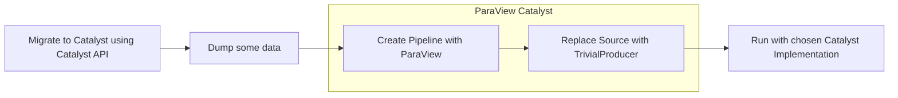

# You're now ready for Catalyst 🚀

---

# Recap: A typical (ParaView) Catalyst Workflow

The full picture looks more or less like this



1. Adapt your simulation to "speak" Catalyst, via the Catalyst API (e.g. `catalyst_initialize`, ...)
2. Collect some data so that you can easily create (and debug) a visualization pipeline
3. Create the visualization pipeline using ParaView GUI
4. Replace the source with `TrivialProducer`
5. Run

Other implementations might differ slightly, but the Catalyst API is fixed; the implementation can be chosen at runtime for the same code.
Different implementations have different configuration protocols, so you might still need slightly different adapters for different Catalyst implementations.

---
layout: two-cols
layoutClass: gap-x-4
---

### Configuration

- `CATALYST_IMPLEMENTATION_NAME`
- `CATALYST_IMPLEMENTATION_PATHS`

### Debugging

- `CATALYST_DEBUG=1`
- `PARAVIEW_LOG_CATALYST_VERBOSITY=INFO`

### ParaView Visualization Pipeline

```yaml
catalyst:
    scripts:
        filename: myparaview-catalyst-script.py
```

::right::

### Useful references

- [Catalyst documentation](https://catalyst-in-situ.readthedocs.io)
- [Catalyst replay](https://catalyst-in-situ.readthedocs.io/en/latest/catalyst_replay.html)
- [Catalyst repository](https://gitlab.kitware.com/paraview/catalyst)

- [ParaView Catalyst](https://docs.paraview.org/en/latest/Catalyst/index.html)
